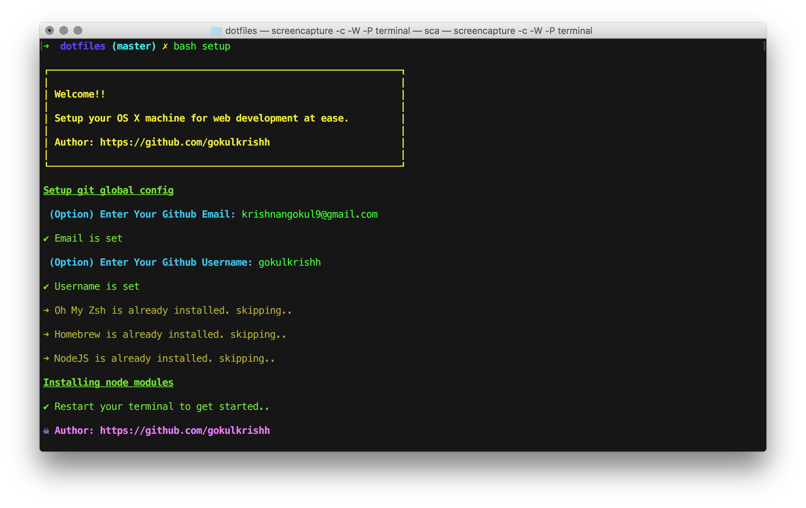

<p align="center"></p>

# dotfiles

_Your cool web development environment is just a few steps away._



## ✨ Steps

##### 1. `Clone & CD into`

```bash
git clone https://github.com/gokulkrishh/dotfiles.git ~/dotfiles && cd dotfiles
```

##### 2 `Find & Add your name & email id` in line no [118](https://github.com/gokulkrishh/dotfiles/blob/master/install.sh#L118) & [100](https://github.com/gokulkrishh/dotfiles/blob/master/install.sh#L100)

##### 3. `Install`

```bash
bash install.sh
```

### 💅 Comes with

- [Oh My Zsh](https://github.com/robbyrussell/oh-my-zsh)
- [Shortcuts & Aliases](./docs/Aliases.md)
- [Homebrew](http://brew.sh/)
- [NVM](https://github.com/lukechilds/zsh-nvm)
- [Yarn](https://yarnpkg.com/)
- [Z - Jump Around](https://github.com/robbyrussell/oh-my-zsh/tree/master/plugins/z)


### ⚙️ Settings & Fonts

- [FiraCode](https://github.com/tonsky/FiraCode)
- [Iterm Profile](./Default.iterm2.json)
- [VSCode Settings](./vscode)

### 🤝 Extra

- [Tools I Use](https://gokul.site/uses)

#### Contributions

- If you wish to contribute to this repository, fork it and send a PR 😬.
- And, if you like the repo, 🌟 it.

##### MIT Licensed
