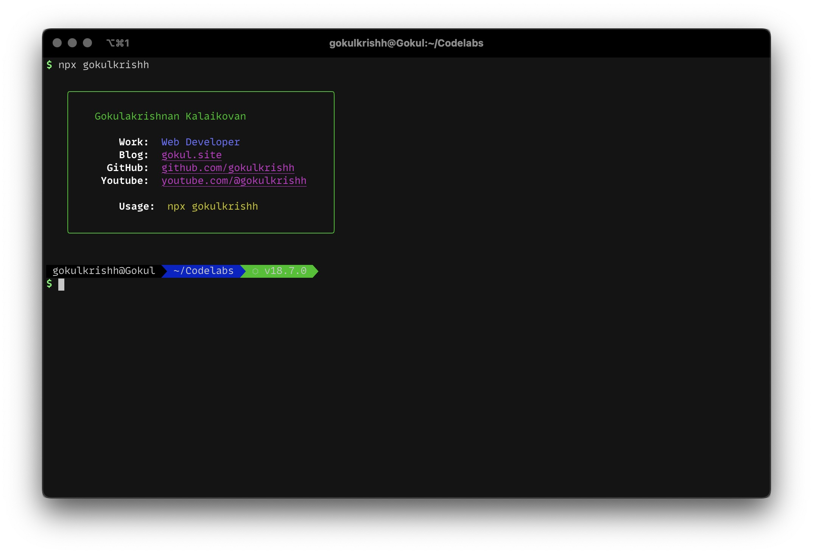

<p align="center"></p>

# dotfiles

_Setup your MacOS for web development at ease._



## ✨ Steps

##### 1. `Clone & CD into`

```bash
git clone https://github.com/gokulkrishh/dotfiles.git ~/dotfiles && cd dotfiles
```

##### 2. `Install`

```bash
bash install.sh
```

> Note: Answer a few questions to setup github, npm etc, for you via command line.

### 💅 Comes with

- [Oh My Zsh](https://github.com/robbyrussell/oh-my-zsh)
- [Shortcuts & Aliases](./docs/Aliases.md)
- [Homebrew](http://brew.sh/) - Installs following apps
  - Brave Browser
  - Visual Studio Code
  - Iterm 2
  - Git & Wget
- [NVM](https://github.com/lukechilds/zsh-nvm)
- [Z - Jump Around](https://github.com/robbyrussell/oh-my-zsh/tree/master/plugins/z)

### ⚙️ Fonts

- [FiraCode](https://github.com/tonsky/FiraCode) - Free
- [MonoLisa](https://www.monolisa.dev) - Paid

### 🤝 Extra

- [Tools I Use](https://gokul.site/uses)

#### Contributions

- If you wish to contribute to this repository, fork it and send a PR 😬.
- And, if you like the repo, 🌟 it.

##### MIT Licensed
